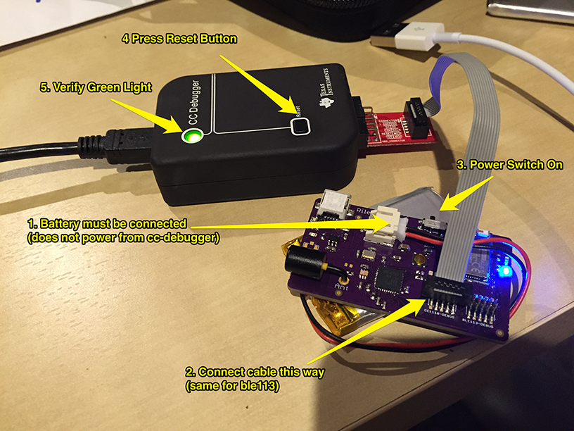

# Loading Firmware

## Prerequisites

* [cc-debugger](http://www.ti.com/tool/cc-debugger)
* linux machine (or VM) with sdcc and cc-tool (to program cc1110)
* windows machine (or VM) with BLE Bluegiga SW Update Tool

## Connecting cc-debugger

